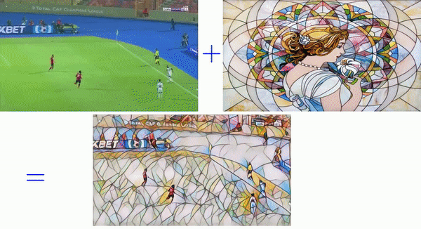

# Neural-Style-Transfer-with-TF

This code acepts an input video and output the video painted with 9
neural style transfer models and save the output demo to a file. 

you can
test it with your own video using 


```
python neural_style_transfer_video_from_file.py --videoFileName yourvideoFile
```

```
optional arguments:
  -h, --help            show this help message and exit
  --modelsFolder MODELSFOLDER
                        path to folder of neural style transfer models
  --everyNFrame EVERYNFRAME
                        Sampling rate
  --videoFileName VIDEOFILENAME
                        Input Video file
  --outputFile OUTPUTFILE
                        Output Video file


```



